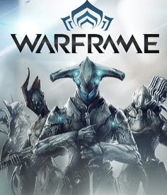
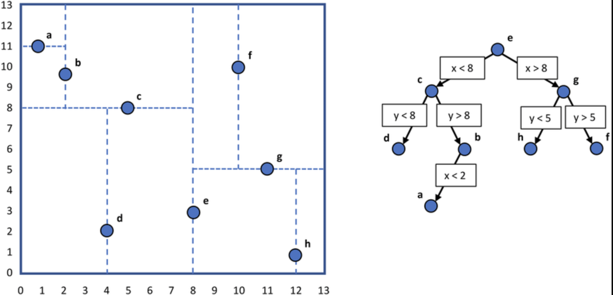

# 16.410 - Principles of Autonomy and Decision Making

MIT Course Number		   16.410 / 16.413

As Taught In						 Fall 2010

Level									  Undergraduate

The planning algorithm of Talos, the MIT entry to the DARPA Urban Challenge, in action. See Lecture 15 for more information. (Image by Emilio Frazzoli.)

## Course Features

- [Readings](./contents/readings/index.htm)
- [Lecture notes](./contents/lecture-notes/index.htm)
- [Recitation](./contents/recitations/index.htm)
- [Assignments](./contents/assignments/index.htm)

## Course Description

This course surveys a variety of reasoning, optimization and decision making methodologies for creating highly autonomous systems and decision support aids. The focus is on principles, algorithms, and their application, taken from the disciplines of artificial intelligence and operations research.

Reasoning paradigms include logic and deduction, heuristic and constraint-based search, model-based reasoning, planning and execution, and machine learning. Optimization paradigms include linear programming, integer programming, and dynamic programming. Decision-making paradigms include decision theoretic planning, and Markov decision processes.

## Motion Planning 

[Steve LaValle - Rapidly exploring Random Topics - YouTube](https://www.youtube.com/watch?v=OjNFjruZgaw)

[Sertac Karaman (MIT) on Motion Planning in a Complex World - MIT Self-Driving Cars - YouTube](https://www.youtube.com/watch?v=0fLSf3NO0-s)

[randoruf/how-to-learn-robotics: 开源机器人学学习指南 (github.com)](https://github.com/randoruf/how-to-learn-robotics)

[ROS/Tutorials - ROS Wiki](http://wiki.ros.org/ROS/Tutorials)

### Planning Algorithms 

[Steven M. LaValle](http://lavalle.pl/books.html)

[Planning Algorithms / Motion Planning (lavalle.pl)](http://lavalle.pl/planning/)

### Planning Libray

[The Open Motion Planning Library (kavrakilab.org)](https://ompl.kavrakilab.org/)

[MoveIt Motion Planning Framework (ros.org)](https://moveit.ros.org/)

[ROS.org | Powering the world's robots](https://www.ros.org/)

## Benmarkers of Path Planning 

[RI Seminar : Sven Koenig: Progress on Multi-Robot Path Finding - YouTube](https://www.youtube.com/watch?v=eqCE_n38yYM)

[Sven Koenig: Multi-Agent Path Planning (idm-lab.org)](http://idm-lab.org/project-p-content.html)

https://www.movingai.com/benchmarks/

https://www.movingai.com/benchmarks/grids.html

| StarCraft                                               | Real-World Building                                     | Dragon Age II                                           | Warframe                                                |
| ------------------------------------------------------- | ------------------------------------------------------- | ------------------------------------------------------- | ------------------------------------------------------- |
|  |  |  |  |

https://www.movingai.com/benchmarks/mapf.html

http://mapf.info/

[mapf.info : webmaster: Sven Koenig | Main / News | browse](http://mapf.info/index.php/Main/News)

[AIcrowd | Flatland | Challenges](https://www.aicrowd.com/challenges/neurips-2020-flatland-challenge/)

RL 还是未来方向。这是 **MAPF** 比赛， 可以明显看到 RL 十分有优势。

[论文合集：大规模多智能体路径规划_手机网易网 (163.com)](https://3g.163.com/dy/article_cambrian/G6HKROV40511D05M.html)

[Multi-agent pathfinding 传统方法和强化学习结合的多智能体路径规划 - 知乎 (zhihu.com)](https://zhuanlan.zhihu.com/p/337729123)

[听说你的多智能体强化学习算法不work？你用对MAPPO了吗_critic (sohu.com)](https://www.sohu.com/a/454213613_129720)

[2010.08184.pdf (arxiv.org)](https://arxiv.org/pdf/2010.08184.pdf)

## Deep Learning 

[MIT Introduction to Deep Learning | 6.S191 - YouTube](https://www.youtube.com/watch?v=5tvmMX8r_OM&t=731s)

[MIT 6.S191 | Deep Learning New Frontiers - YouTube](https://www.youtube.com/watch?v=-boCMDouF2g)

https://github.com/aikorea/awesome-rl

This "awesome" page has all sorts of RL resources -- code, papers, applications.

http://www.wildml.com/2016/10/learning-reinforcement-learning/

This page is an up-to-date learning environment for RL that is hooked up to code and exercises in OpenAI Gym.

https://gym.openai.com/

Here is the direct link to OpenAI Gym, a toolkit for developing and comparing reinforcement learning algorithms. It supports teaching agents everything from walking to playing games like Pong or Go.

### Deep Reinforcement Learning

[MIT 6.S191: Reinforcement Learning - YouTube](https://www.youtube.com/watch?v=93M1l_nrhpQ)

[MIT 6.S191 (2019): Deep Reinforcement Learning - YouTube](https://www.youtube.com/watch?v=i6Mi2_QM3rA)

https://github.com/muupan/deep-reinforcement-learning-papers

Here is a nice collection of papers, talk slides, etc. on Deep RL.

https://github.com/nivwusquorum/tensorflow-deepq

GitHub -- Code for RL using tensor flow

http://videolectures.net/rldm2015_silver_reinforcement_learning/

Tutorial by David Silver on Deep RL.

### RRT and RRT\* 

kdTree and Ball Tree

[Asypmotically-optimal Path Planning for Manipulation (IROS '11) - YouTube](https://www.youtube.com/watch?v=ag-txw4KUgo)

[RRT* algorithm on the PR2 - planning with both arms (12 DOF) - YouTube](https://www.youtube.com/watch?v=2WOBMswcCA8)

[16: KD Trees (cornell.edu)](https://www.cs.cornell.edu/courses/cs4780/2017sp/lectures/lecturenote16.html)

### UVA Simulation 

[FlightGoggles in AlphaPilot simulation qualifiers - YouTube](https://www.youtube.com/watch?v=4Q0eWI2UiT4)

[FlightGoggles: Photorealistic Sensor Simulation for Perception-driven Robotics using Photogrammetry and Virtual Reality (mit.edu)](https://flightgoggles.mit.edu/)

### CARLA Simulation 

[CARLA AD Challenge (carlachallenge.org)](https://carlachallenge.org/)

[CARLA Simulator](https://carla.org/)

## Virtual Reality

[Virtual Reality - LaValle](http://lavalle.pl/vr/)

Quaternion, Euler angle,

Coordinate Transformaton (translation and rotation)... 

It highly relates to the book **"planning algorithm"**

## Sensing and Filtering

**A Fresh Perspective Based on Preimages and Information Spaces**

[Steven M. LaValle](http://lavalle.pl/books.html)

## Mobile Robotics

**An Information Space Approach**

[Steven M. LaValle](http://lavalle.pl/books.html)

## Course Collections

- [Cognitive Science](https://ocw.mit.edu/courses/find-by-topic/#cat=science&subcat=cognitivescience)
- [Computer Science > Artificial Intelligence](https://ocw.mit.edu/courses/find-by-topic/#cat=engineering&subcat=computerscience&spec=artificialintelligence)
- [Game Theory](https://ocw.mit.edu/courses/find-by-topic/#cat=socialscience&subcat=gametheory)
- [Systems Engineering > Systems Optimization](https://ocw.mit.edu/courses/find-by-topic/#cat=engineering&subcat=systemsengineering&spec=systemsoptimization)
- [Computer Science > Algorithms and Data Structures](https://ocw.mit.edu/courses/find-by-topic/#cat=engineering&subcat=computerscience&spec=algorithmsanddatastructures)

