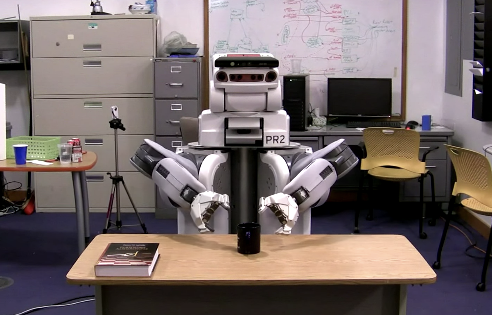

# 16.410 - Principles of Autonomy and Decision Making

MIT Course Number		   16.410 / 16.413

As Taught In						 Fall 2010

Level									  Undergraduate

The planning algorithm of Talos, the MIT entry to the DARPA Urban Challenge, in action. See Lecture 15 for more information. (Image by Emilio Frazzoli.)

## Course Features

- [Readings](./contents/readings/index.htm)
- [Lecture notes](./contents/lecture-notes/index.htm)
- [Recitation](./contents/recitations/index.htm)
- [Assignments](./contents/assignments/index.htm)

## Course Description

This course surveys a variety of reasoning, optimization and decision making methodologies for creating highly autonomous systems and decision support aids. The focus is on principles, algorithms, and their application, taken from the disciplines of artificial intelligence and operations research.

Reasoning paradigms include logic and deduction, heuristic and constraint-based search, model-based reasoning, planning and execution, and machine learning. Optimization paradigms include linear programming, integer programming, and dynamic programming. Decision-making paradigms include decision theoretic planning, and Markov decision processes.

## Motion Planning 

[Steve LaValle - Rapidly exploring Random Topics - YouTube](https://www.youtube.com/watch?v=OjNFjruZgaw)

[Sertac Karaman (MIT) on Motion Planning in a Complex World - MIT Self-Driving Cars - YouTube](https://www.youtube.com/watch?v=0fLSf3NO0-s)

[randoruf/how-to-learn-robotics: 开源机器人学学习指南 (github.com)](https://github.com/randoruf/how-to-learn-robotics)

[ROS/Tutorials - ROS Wiki](http://wiki.ros.org/ROS/Tutorials)

### Planning Algorithms 

[Planning Algorithms / Motion Planning (lavalle.pl)](http://lavalle.pl/planning/)

[Steven M. LaValle](http://lavalle.pl/books.html)

### Planning Libray

[The Open Motion Planning Library (kavrakilab.org)](https://ompl.kavrakilab.org/)

[MoveIt Motion Planning Framework (ros.org)](https://moveit.ros.org/)

[ROS.org | Powering the world's robots](https://www.ros.org/)

### RRT and RRT\* 

kdTree and Ball Tree

[Asypmotically-optimal Path Planning for Manipulation (IROS '11) - YouTube](https://www.youtube.com/watch?v=ag-txw4KUgo)

[RRT* algorithm on the PR2 - planning with both arms (12 DOF) - YouTube](https://www.youtube.com/watch?v=2WOBMswcCA8)

[16: KD Trees (cornell.edu)](https://www.cs.cornell.edu/courses/cs4780/2017sp/lectures/lecturenote16.html)

### UVA Simulation 

[FlightGoggles in AlphaPilot simulation qualifiers - YouTube](https://www.youtube.com/watch?v=4Q0eWI2UiT4)

[FlightGoggles: Photorealistic Sensor Simulation for Perception-driven Robotics using Photogrammetry and Virtual Reality (mit.edu)](https://flightgoggles.mit.edu/)

### CARLA Simulation 

[CARLA AD Challenge (carlachallenge.org)](https://carlachallenge.org/)

[CARLA Simulator](https://carla.org/)

## Course Collections

- [Cognitive Science](https://ocw.mit.edu/courses/find-by-topic/#cat=science&subcat=cognitivescience)
- [Computer Science > Artificial Intelligence](https://ocw.mit.edu/courses/find-by-topic/#cat=engineering&subcat=computerscience&spec=artificialintelligence)
- [Game Theory](https://ocw.mit.edu/courses/find-by-topic/#cat=socialscience&subcat=gametheory)
- [Systems Engineering > Systems Optimization](https://ocw.mit.edu/courses/find-by-topic/#cat=engineering&subcat=systemsengineering&spec=systemsoptimization)
- [Computer Science > Algorithms and Data Structures](https://ocw.mit.edu/courses/find-by-topic/#cat=engineering&subcat=computerscience&spec=algorithmsanddatastructures)

