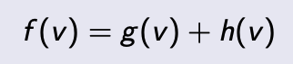
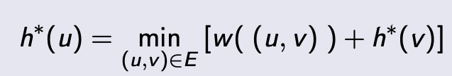
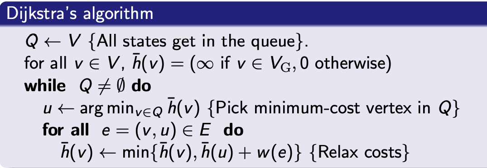

# Lecture 14 -  Global path planning I

http://randoruf.github.io/mit-16-410-principles-autonomy-and-decision-making/contents/lecture-notes/MIT16_410F10_lec14.pdf

## Informed Search Method 

#### Uniform-cost search

Used in **weighted-graph**. 

Try to answer the question

> What is ***the minimum cost from the root to a particular node***? 

Because we **<u>will not revisit a node</u>**, **the graph is converted to a *tree***.  Up to now, we know 

- We need to **explore the node with minimum cost at first**   ->  priotity queue 
- The graph becomes a tree -> each node needs to know its parent. 

#### Greedy (Best-First) Search 

Used in **weighted-graph**, in stead of measuring the **cost** from root to a node, we

> What is ***the minimum distance from the current node to destination***. 

But Best First Search is not optimal. 

#### A Search and A* Search 

Used in **weighted-graph**. The idea behind A search is to combine Dijkstra(Breadth First) and Best First Search, 

- `g(v)`  is cost-from-root (***since searching the graph in a tree way***, so I denote the start as root). 
- `h(v)` is cost-to-goal

***If chosing `h(v)` correctly, the A search is guranteed to be optimal.*** 

(How to choose `h(v)` ? see http://theory.stanford.edu/~amitp/GameProgramming/Heuristics.html, it should never overestimate the cost-to-go. see Slide pp43). 

In other words, a consistent heuristics satisfies a **triangle inequality**.

- <u>Euclidean Distance</u> (the normed vector space)
- Manhattan distance
- Diagonal distance

With the proper heurstic, the A search is optimal, hence it is called **A\*** (the star means optimal). 

 

## Dynamic Programming

A very simple idea: 

> **<u>Optimal paths are made of optimal paths</u>**.  

From node ***v*** to ***u*** , the minimum cost of ***u*** is the minmum cost of ***v***  plus the weight of ***edge (u, v)***. 

(if we know the optimal cost of ***v***, we will be able to compute the optimal cost for ***u***)

A very special case of Dynamic Programming in graph searching is Dijkstra's algorithm. 

(The **relaxation** : 尝试从不同的路径到达 ***v***, 然后取其中最优的)。 

### D\* and D\* -lite: versions of A\* for uncertain graphs.

<https://en.wikipedia.org/wiki/D*>

D\* and its variants have been widely used for [mobile robot](https://en.wikipedia.org/wiki/Mobile_robot) and [autonomous vehicle](https://en.wikipedia.org/wiki/Autonomous_vehicle) [navigation](https://en.wikipedia.org/wiki/Navigation_research). Current systems are typically based on ***D\* Lite*** rather than the original D\* or Focussed D\*.

The original D\* was introduced by Anthony Stentz in 1994. The name D\* comes from the term "Dynamic A\*"because the algorithm behaves like A\* except that the **<u>arc costs can change as the algorithm runs</u>**.

Note: 

- [**D* Lite**](https://en.wikipedia.org/wiki/D*#D.2A_Lite), a reimplementation of the [D*](https://en.wikipedia.org/wiki/D*) algorithm **based on Lifeong Planning A\* (LPA*)**. 

